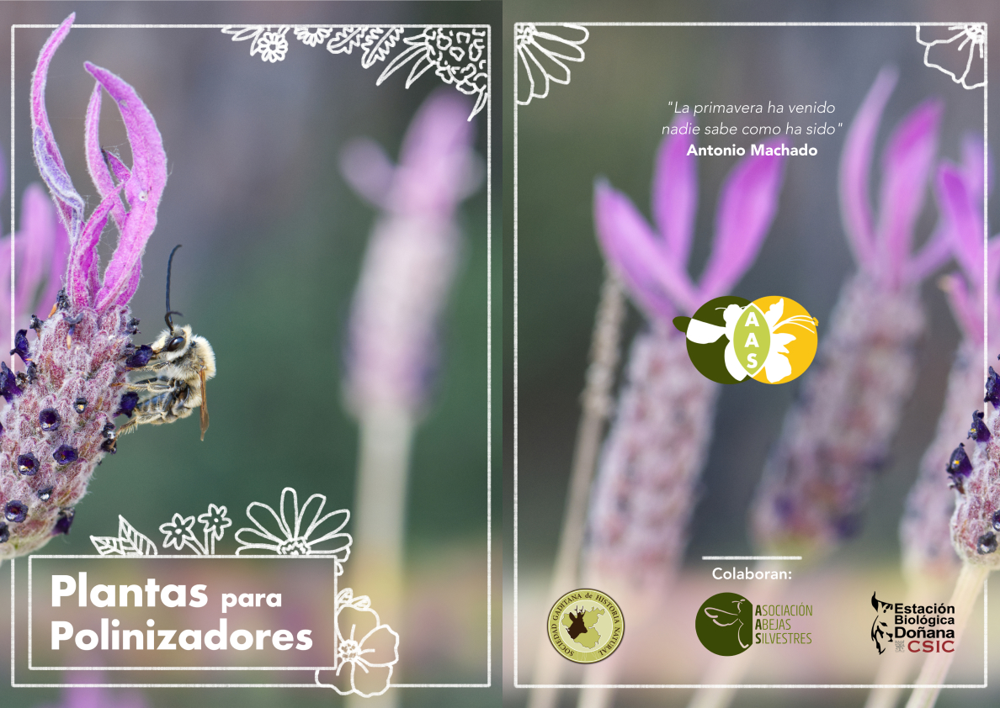
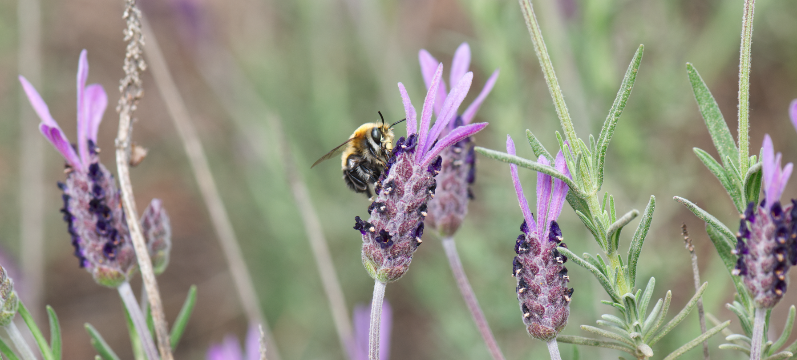
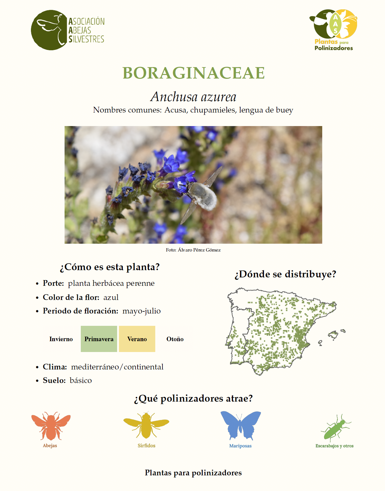

# **Plantas silvestres para Abejas silvestres**

## Introducción

Una de las [acciones de conservación](https://www.abejassilvestres.es/projects/zumbeedos) más eficaces para ayudar a las abejas es **plantar flores silvestres**. Estas les darán alimento en forma de polen y néctar. Balcones, terrazas y jardines son espacios fáciles de llenar de plantas, así como patios de colegio, lindes de campos de cultivo o descampados abandonados. Además de beneficiar a los polinizadores, las plantas capturan carbono, mejoran la calidad del suelo y aportan sombra, contribuyendo así a la regulación del clima. Pero...

Pero...

## ¿Qué plantas puedo usar?

Una respuesta típica es que las aromáticas como el romero o la lavanda son muy atractivas para los polinizadores, y es cierto. Pero con más de 1100 especies de abejas silvestres en la Península Ibérica, la respuesta es mucho más compleja.

Lo ideal es usar plantas que sean:

-   **Nativas**: son las plantas a las que nuestras abejas están acostumbradas, y están adaptadas a nuestras condiciones climáticas. Además, evitamos que especies exóticas se expandan donde no las queremos.

-   **Diversas**: cada polinizador tiene sus preferencias, por lo que, para ayudar a una gran variedad de especies, necesitamos una gran variedad de plantas. Cuantas más especies uses, mejor, y procura que tengan flores de distintos tamaños, formas y colores.

-   **Complementarias**: desde enero hasta diciembre hay polinizadores activos, así que elegir plantas con floraciones escalonadas es ideal para que haya recursos a lo largo de toda la temporada. Como esta explicación sigue siendo algo ambigua para saber qué plantar exactamente, desde Abejas Silvestres hemos elaborado una lista con casi 200 especies para elegir.

## ¿Cómo elijo un buen conjunto de plantas?

Para crear un espacio atractivo para polinizadores, empieza por elegir plantas que se adapten a tu entorno. Ten en cuenta el tipo de vegetación (árboles, arbustos o herbáceas) y el espacio disponible: si puedes combinar los tres tipos, conseguirás una estructura más diversa y estable. A continuación, elige 2–3 especies por cada estación (primavera, verano y otoño), de modo que siempre haya flores disponibles. También es importante pensar en los distintos grupos de polinizadores (abejas, sírfidos, mariposas y escarabajos), ya que cada uno tiene preferencias diferentes en cuanto a forma, color y accesibilidad de las flores. Y recuerda: estas son solo algunas sugerencias. Hay muchas otras plantas útiles y atractivas para polinizadores. Si tienes alguna especie favorita que te gustaría que incluyéramos en la guía, [escríbenos](mailto:%20info.abejas.silvestres@gmail.com) y la añadiremos.

## Fichas

Hemos creado estas fichas para que te sea más fácil elegir qué plantas utilizar, según tu localización y tu clima:

Descárgate aquí la versión completa, con más de 170 especies!

-   [alta calidad](https://drive.google.com/drive/folders/1F6ycgnj_ynSbSFl00GjAN1A35Nf21sGf)

-   [baja calidad](https://github.com/juliagdealedo/Plantas_para_polinizadores/blob/master/Plantas-polinizadores-completo-low.pdf)

También puedes echarle un vistazo a nuestra [web](https://abejas-silvestres.vercel.app/resources/plants-guide), donde encontrarás una tabla con toda esta información.

## Referencias
Estas fichas han sido creadas en R, aquí puedes encontrar el [**código**](https://github.com/juliagdealedo/Plantas_para_polinizadores/blob/master/Codigo/fichas_chk.R) para crear las fichas del proyecto.\

-   Ramos-Gutierrez I, de Aledo JG, Mateo-Martín J, Rodríguez-Sánchez F (2025). labeleR: Automate the Production of Custom Labels, Badges, Certificates, and Other Documents. <https://EcologyR.github.io/labeleR/>.

-   Rodríguez-Sánchez, F. Flora Iberica Package: <https://pakillo.github.io/FloraIberica/>

-   Ramos-Gutiérrez et al., 2021: AFLIBER: <https://doi.org/10.1111/geb.13363>

## Crédito

> **Crédito:** Esto ha sido posible gracias a Curro Molina, Julia G. de Aledo, Nerea Montes Pérez, María José Navarro-Ramos, Yaiza Sauquillo, Álvaro Pérez-Gómez, Yaiza Sauquillo, Ignasi Bartomeus.

> **Diseño de fichas y maquetación**: Julia G. de Aledo.

> **Mapa de distribución** de la especie obtenido de la fuente AFLIBER (Ramos-Gutiérrez et al., 2021)

> **Portada, iconos y logo**: Nerea Montes Pérez.

> **Foto de la portada**: Curro Molina.
>
> **Colaboran**: Asociación de Abejas Silvestres, Sociedad Gaditana de Historia Natural, Estación Biológica de Doñana
